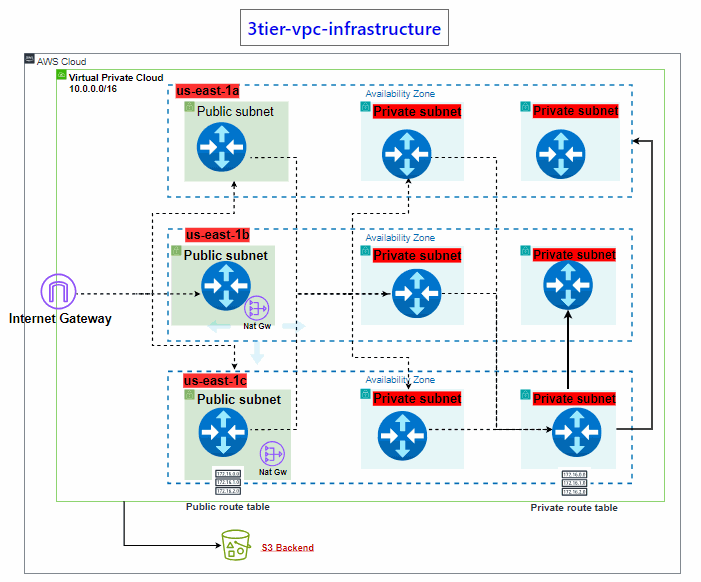

# 3tier-vpc-infrastructure
Create 3-Tier VPC Architecture using Terraform Module

This Terraform module creates a production-ready AWS Virtual Private Cloud (VPC) environment, complete with public, private, and database subnets, route tables, internet and NAT gateways, and a layered security group structure for a typical 3-tier architecture.

### **Author**
- Paul Max Chamblain | 

[Linkedin] (https://www.linkedin.com/in/paulmchamblain/)

### Below is an image showcasing the architecture of the cloud-based application I built.

## 🔧 Features

- VPC with customizable CIDR
- Public, Private, and DB subnets across 3 AZs
- Internet Gateway and NAT Gateway setup
- Route tables for public, private, and DB subnets
- Layered security groups:
  - Face client (Internet-facing)
  - Web server (behind face client)
  - Backend load balancer
  - Application server
  - Database server (MySQL)
  - Bastion host (SSH access from admin IP)

module "vpc" {
  source = "./vpc-module"

  aws_region           = "us-east-1"
  project_name         = "tech123"
  netw_cidr            = "10.0.0.0/16"
  availability_zones   = ["us-east-1a", "us-east-1b", "us-east-1c"]
  public_subnets_cidr  = ["10.0.1.0/24", "10.0.2.0/24", "10.0.3.0/24"]
  private_subnets_cidr = ["10.0.11.0/24", "10.0.12.0/24", "10.0.13.0/24"]
  db_subnets_cidr      = ["10.0.21.0/24", "10.0.22.0/24", "10.0.23.0/24"]
  my_ip                = ["0.0.0./0"]
}

🚀 Outputs
VPC ID and CIDR

Subnet IDs (public, private, DB)

Route Table IDs

Internet Gateway and NAT Gateway IDs

Security Group IDs

✅ Requirements
Terraform >= 1.3

AWS CLI configured

AWS account with proper IAM permissions

